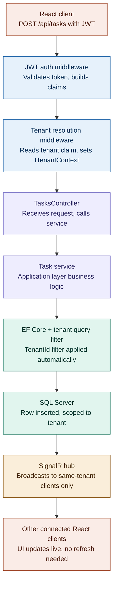

# TenantFlow

**A multi-tenant SaaS project management platform with JWT-based tenant isolation and real-time task updates via SignalR.**

## Multi-Tenancy Architecture

TenantFlow is built as a single shared-database, multi-tenant application. Every tenant-scoped entity (`Project`, `Task`, `User`) carries a `TenantId`, and EF Core global query filters — driven by an injected `ITenantContext` — automatically scope every query to the current tenant. A user from Company A can never see Company B's data, even by accident, because the isolation is enforced centrally in the `DbContext` rather than repeated in every query.

Database-per-tenant or schema-per-tenant would give stronger physical isolation, but at real infrastructure and operational cost. For a portfolio-stage app, shared-database with row-level isolation is the more realistic, scalable starting point — the same approach many real SaaS products use early on, before scale or compliance needs justify physical separation.

**Known limitation:** isolation is currently enforced at the application layer only (EF Core query filters), not reinforced with SQL Server Row-Level Security (RLS) policies at the database layer. A raw SQL query that bypasses EF Core could theoretically cross tenant boundaries. RLS as a defense-in-depth layer is a natural next hardening step — it wasn't in scope for the initial build, and is one of the first things I'd add before this went near production traffic.

## Architecture

The diagram below traces a single request — creating a task — through every layer of the system, from the JWT on the client to the real-time update pushed back out to other connected users in the same tenant.



Tenant isolation is enforced at the EF Core layer (step 6), before any data reaches the database — and SignalR broadcasts (step 8) are scoped to the same tenant, so real-time updates never leak across tenant boundaries either.

## Tech Stack

**Backend**: ASP.NET Core 9, Entity Framework Core, SQL Server 2022, SignalR, JWT Authentication
**Frontend**: React, TypeScript, Vite, Tailwind CSS
**Infrastructure**: Docker, Docker Compose

## Running with Docker

TenantFlow runs as a three-container stack: SQL Server, the ASP.NET Core API, and the React frontend served via Nginx.

### Prerequisites

- Docker Desktop (with at least 4GB memory allocated — SQL Server requires a minimum of 2GB)
- Copy `.env.example` to `.env` and fill in real values

### Running

```bash
docker compose up
```

This builds and starts all three services:
- `db` — SQL Server 2022
- `api` — ASP.NET Core 9 Web API (port 5253)
- `frontend` — React app served via Nginx (port 3000)

### Architecture notes

**Migrations run automatically on API startup**, via `dbContext.Database.Migrate()` in `Program.cs`, rather than the `dotnet ef` CLI. This is a deliberate choice: the final API image is built from the .NET runtime base image (not the SDK) to keep the production image small, and the SDK is required for `dotnet ef` commands. Calling `Database.Migrate()` programmatically uses the EF Core runtime library directly, requiring no SDK or CLI tooling.

This approach is appropriate for a single-instance deployment like this one. In a horizontally-scaled production environment with multiple API replicas starting simultaneously, this pattern can cause migration race conditions — a separate migration step (run once, before scaling up API instances) would be the safer choice at that scale.

**The API container connects to SQL Server using the Docker Compose service name (`db`), not `localhost`** — containers on the same Compose network resolve each other by service name.

**Secrets are managed via `.env`** (gitignored) rather than hardcoded in `docker-compose.yml`, following the same pattern used for `appsettings.Development.json`.

**Containerizing surfaced a real bug**: replaying the full migration history against a fresh database revealed two duplicate-column migrations that had gone unnoticed during incremental local development. `AddTenantIsolationColumns` was attempting to add `PasswordHash`, `Role`, and `TenantId` columns that `Baseline` already created — invisible locally because the local database had migrations applied incrementally, never replayed from zero. Fixed by editing the affected migration directly to remove the redundant operations, preserving its already-applied history rather than regenerating it.

## Problems Solved

- **Role-based authorization wasn't working** — ASP.NET Core rewrites claim types under the hood by default; fixed by explicitly mapping them during JWT setup.
- **Deleted tasks still showed up on the dashboard** — looked like a UI bug, was actually a missing filter in the backend query.
- **Docker build worked on Windows, broke on Linux** — a shell script's line endings weren't Linux-compatible; fixed with a `.gitattributes` rule.
- **CORS settings needed a code change per environment** — moved allowed origins into config instead of hardcoding them.
- **SQL Server kept failing to start in Docker** — Docker Desktop wasn't allocating enough memory; fixed via a WSL2 config change.