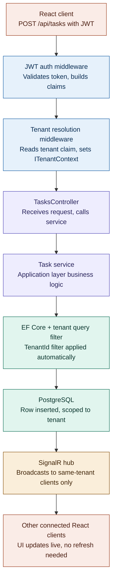

# TenantFlow

**A multi-tenant SaaS project management platform with JWT-based tenant isolation and real-time task updates via SignalR.**


Built to explore multi-tenant SaaS data isolation patterns and real-time sync at the architecture level — not just the UI level.

**[Live demo](https://tenantflow-dhvani.netlify.app)** · **[Frontend repo](https://github.com/Dhvani2210/TenantFlow.Frontend)**

**API base URL:** `https://tenantflow-8xgc.onrender.com` — a REST API with no root page; hitting endpoints directly in a browser (GET-only) will show `404`/`405` responses, which is expected.

> **Note on the live demo:** the API is hosted on Render's free tier, which spins down after 15 minutes of inactivity. The **first** request after idle time can take 30–60 seconds to wake back up — this is a hosting-tier limitation, not an application bug. Subsequent requests are fast.

## Features

- Multi-tenant project & task management with strict data isolation between tenants
- JWT authentication with role-based access control (Admin / Manager / Developer)
- Real-time task updates pushed to all connected users in the same tenant via SignalR
- Dockerized full stack (API, Postgres, frontend) with automated CI/CD via GitHub Actions
- Deployed live on free-tier infrastructure: Neon (Postgres), Render (API), Netlify (frontend)

## Tech Stack

**Backend**: ASP.NET Core 9, Entity Framework Core, PostgreSQL, SignalR, JWT Authentication
**Frontend**: React, TypeScript, Vite, Tailwind CSS, React Router, Axios
**Infrastructure**: Docker, Docker Compose, GitHub Actions CI/CD
**Hosting**: Neon (database), Render (API), Netlify (frontend)

## Architecture

The diagram below traces a single request — creating a task — through every layer of the system, from the JWT on the client to the real-time update pushed back out to other connected users in the same tenant.



Tenant isolation is enforced at the EF Core layer (step 6), before any data reaches the database — and SignalR broadcasts (step 8) are scoped to the same tenant, so real-time updates never leak across tenant boundaries either.

## Multi-Tenancy Architecture

TenantFlow is built as a single shared-database, multi-tenant application. Every tenant-scoped entity (`Project`, `Task`, `User`) carries a `TenantId`, and EF Core global query filters — driven by an injected `ITenantContext` — automatically scope every query to the current tenant. A user from Company A can never see Company B's data, even by accident, because the isolation is enforced centrally in the `DbContext` rather than repeated in every query.

Database-per-tenant or schema-per-tenant would give stronger physical isolation, but at real infrastructure and operational cost. For a portfolio-stage app, shared-database with row-level isolation is the more realistic, scalable starting point — the same approach many real SaaS products use early on, before scale or compliance needs justify physical separation.

**Known limitation:** isolation is currently enforced at the application layer only (EF Core query filters), not reinforced with database-level Row-Level Security (RLS) policies. A raw SQL query that bypasses EF Core could theoretically cross tenant boundaries. RLS as a defense-in-depth layer is a natural next hardening step — it wasn't in scope for the initial build, and is one of the first things I'd add before this went near production traffic.

## Authentication

TenantFlow uses short-lived JWT access tokens (15 minutes) paired with long-lived refresh tokens (7 days), rather than a single long-lived JWT. The access token is returned in the response body and kept in memory on the client; the refresh token is delivered as an `HttpOnly`, `Secure` cookie, scoped to `/api/auth`, so it's never readable by JavaScript — a meaningful mitigation against XSS-based token theft.

Refresh tokens are tracked server-side (hashed, never stored raw) and rotated on every use: each `/refresh` call invalidates the token that was used and issues a new one. If a stolen refresh token is ever reused after the legitimate user has already refreshed, the reuse fails — a signal that something's wrong, rather than a silent compromise that works until natural expiry.

**Known limitation:** no mechanism yet to revoke a specific session remotely (e.g. "log out all other devices") — only the session tied to the refresh token being used can log itself out.


## Deployment

The live demo runs on three separate free-tier services:

| Layer | Service | Notes |
|---|---|---|
| Database | [Neon](https://neon.tech) | Serverless Postgres, autosuspends when idle |
| API | [Render](https://render.com) | Free web service, built from the repo's `Dockerfile`; spins down after 15 min idle |
| Frontend | [Netlify](https://netlify.com) | Static Vite build, auto-deploys on push to `main` |

**Environment variables on Render** (set via the dashboard, not committed to the repo):
`ConnectionStrings__DefaultConnection`, `Jwt__Key`, `Jwt__Issuer`, `Jwt__Audience`, `Cors__AllowedOrigins__0`

**Environment variables on Netlify**: `VITE_API_URL` — set to the Render API URL. Note: Vite bakes environment variables in at *build time*, so changing this value requires triggering a new Netlify deploy, not just saving the variable.

### Postgres migration notes

This project originally targeted SQL Server and was migrated to PostgreSQL (via Neon) to support free-tier hosting. Key changes made during that migration:

- Swapped `Microsoft.EntityFrameworkCore.SqlServer` → `Npgsql.EntityFrameworkCore.PostgreSQL`, and `UseSqlServer` → `UseNpgsql`
- Regenerated migrations from scratch against Postgres; converted SQL Server-specific defaults (`NEWSEQUENTIALID()` → `gen_random_uuid()`, `GETUTCDATE()` → `CURRENT_TIMESTAMP`, `datetime2` → `timestamptz`)
- Postgres's default collation is case-sensitive, unlike SQL Server's — `TaskRepository`'s search filter was changed from `.Contains()` to `EF.Functions.ILike(...)` to preserve case-insensitive search behavior
- Fixed a latent email case-sensitivity bug this exposed: emails are now normalized to lowercase at both write time and read time, since Postgres would otherwise treat `User@x.com` and `user@x.com` as distinct rows
- Postgres table/column names are case-sensitive when quoted (which EF Core does by default) — raw SQL queries against the database (e.g. via a SQL editor) need double quotes around identifiers, e.g. `select * from "Tasks";`

## Running with Docker (local development)

TenantFlow runs as a three-container stack: Postgres, the ASP.NET Core API, and the React frontend served via Nginx.

### Prerequisites

- Docker Desktop
- Copy `.env.example` to `.env` and fill in real values

### Running

```bash
docker compose up
```

This builds and starts all three services:
- `db` — PostgreSQL
- `api` — ASP.NET Core 9 Web API (port 5253)
- `frontend` — React app served via Nginx (port 3000)

### Architecture notes

- **Migrations run automatically on API startup**, via `dbContext.Database.Migrate()` in `Program.cs`, rather than the `dotnet ef` CLI. The final API image is built from the .NET *runtime* base image (not the SDK) to keep the production image small — `Database.Migrate()` uses the EF Core runtime library directly, so no SDK or CLI tooling is needed at runtime.
- **This pattern suits a single-instance deployment.** In a horizontally-scaled setup with multiple API replicas starting simultaneously, automatic migration-on-startup can cause race conditions — a separate migration step (run once, before scaling up API instances) would be the safer choice at that scale.
- **Locally, the API connects to Postgres via the Docker Compose service name (`db`), not `localhost`** — containers on the same Compose network resolve each other by service name. In the hosted deployment, the API connects to Neon over the public internet instead, so `entrypoint.sh`'s original "wait for `db`" logic (meaningful only in the local Compose network) was removed — it caused deploys to hang indefinitely on Render, since no host named `db` exists there.
- **Secrets are managed via `.env`** locally (gitignored) and via each platform's environment variable dashboard in production — never hardcoded in `docker-compose.yml` or committed to the repo.
- **Sensitive EF Core query/data logging is enabled only in the `Development` environment** — it's off by default in `Production` (which Render uses unless told otherwise), since it can log actual data values and isn't appropriate outside local debugging.
- **Containerizing surfaced a real bug**: replaying the full migration history against a fresh database revealed two duplicate-column migrations that had gone unnoticed during incremental local development. `AddTenantIsolationColumns` was attempting to add `PasswordHash`, `Role`, and `TenantId` columns that `Baseline` already created — invisible locally because the local database had migrations applied incrementally, never replayed from zero. Fixed by editing the affected migration directly to remove the redundant operations, preserving its already-applied history rather than regenerating it.

## Problems Solved

- **Role-based authorization wasn't working** — ASP.NET Core rewrites claim types under the hood by default; fixed by explicitly mapping them during JWT setup.
- **Deleted tasks still showed up on the dashboard** — looked like a UI bug, was actually a missing filter in the backend query.
- **Docker build worked on Windows, broke on Linux** — a shell script's line endings weren't Linux-compatible; fixed with a `.gitattributes` rule.
- **CORS settings needed a code change per environment** — moved allowed origins into config instead of hardcoding them.
- **Deploys hung indefinitely on Render** — `entrypoint.sh` waited for a host named `db`, which only existed in the local Docker Compose network. Removed the wait logic entirely, since Neon (the hosted database) is always available and needs no startup delay.
- **Task assignee name not updating in real time after edit** — looked like a frontend state sync problem, was actually a backend bug. `TaskRepository.UpdateAsync` fetched the task without `.Include(t => t.AssignedTo)`, then overwrote `AssignedToUserId` with the new value — but EF Core doesn't automatically refresh navigation properties when a foreign key changes. The `AssignedTo` property stayed pointing at the old user (or null), so `MapToDto` produced `assignedToUserName: null` in the response. Fixed by calling `_context.Entry(existing).Reference(t => t.AssignedTo).LoadAsync()` after `SaveChangesAsync()` to explicitly reload the navigation property. Confirmed via curl before touching any frontend code.

## Testing

Unit tests cover `TenantResolutionMiddleware` — the component responsible for extracting the tenant ID from the JWT and setting it on `ITenantContext` for every downstream request. Tests use a hand-written fake (`FakeTenantContextSetter`) rather than a mocking library, and cover:

- A valid `TenantId` claim correctly resolves and sets the tenant context
- A missing `TenantId` claim does *not* set a tenant context (fails closed, not open)
- A malformed `TenantId` claim (non-GUID) is rejected rather than silently ignored or crashing

This is the middleware that tenant isolation depends on, so it's the piece most worth testing in isolation — if it resolves the wrong tenant, or resolves one when it shouldn't, the EF Core query filters downstream would enforce the wrong boundary.

Beyond this, most endpoints were manually verified via curl/Postman during development, and the full deployed stack (registration, login, multi-tenant isolation, and real-time SignalR updates) has been verified end-to-end in production. Broader automated integration test coverage — particularly around EF Core's query filters actually blocking cross-tenant reads/writes — is next on the roadmap.

## Roadmap

- Row-Level Security as a defense-in-depth layer under the EF Core query filters
- Integration tests around EF Core's tenant query filters (building on the existing middleware unit tests)
- Separate, explicit migration step for horizontally-scaled deployments
- Custom domain for the live demo

## License

Distributed under the MIT License. See `LICENSE` for details.